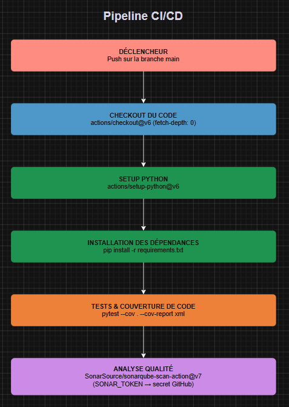

# Questionnaire – Pipeline CI/CD

## Question 1

Les définitions des pipelines CI/CD se trouvent dans l'onglet **Actions** du dépôt GitHub. C'est là que l'on peut visualiser les workflows, leurs exécutions et leur historique.

Les fichiers de définition YAML correspondants sont stockés dans le répertoire **`.github/workflows/`** à la racine du dépôt. Dans le dépôt `fluffy-octo-sniffle`, le fichier est `.github/workflows/build.yaml`.

---

## Question 2



Le fichier source draw.io (`schema.drawio`) est présent à la racine du dossier.

---

## Question 3

La pipeline **ne peut pas être reproduite à l'identique** avec Jenkins pour les raisons suivantes :

- **Version Python non définie** : le workflow utilise `${{ matrix.python }}` mais aucune `strategy.matrix` n'est déclarée dans le job. La variable est vide et la version Python réellement utilisée est inconnue. Il est donc impossible de reproduire exactement le même comportement.
- **Secret GitHub** : `SONAR_TOKEN` est stocké comme secret GitHub Actions. Avec Jenkins, il faudra le recréer en tant que credential de type *Secret text*.
- **Actions propriétaires** : `actions/checkout@v6`, `actions/setup-python@v6` et `SonarSource/sonarqube-scan-action@v7` sont des actions spécifiques à GitHub Actions. Avec Jenkins, il faut les remplacer par : le plugin *Git* pour le checkout, un agent avec Python installé (ou une image Docker Python), et le plugin *SonarQube Scanner* pour l'analyse.

---

## Question 4

Critiques du fichier `compose.yaml` du projet `fluffy-octo-sniffle` :

- **Tag `latest` non versionné** : `sonarqube:latest` et `sonarsource/sonar-scanner-cli` (sans tag) ne sont pas fixés sur une version précise. Le déploiement n'est pas reproductible et une mise à jour silencieuse peut casser l'environnement.
- **Secret en clair dans le fichier** : `SONAR_TOKEN=sqa_31c555e7e23233b40688c0f1641b37a180031fdc` est exposé directement dans le fichier Compose. C'est une faille de sécurité majeure — ce token peut être révoqué par toute personne ayant accès au dépôt ou à ce fichier.
- **Absence de volume persistant** : SonarQube ne dispose d'aucun volume pour persister ses données, sa configuration ou ses analyses entre les redémarrages du conteneur.
- **Absence de `depends_on`** : le service `cli` peut démarrer avant que SonarQube soit prêt à accepter des connexions, ce qui provoque des erreurs d'analyse.
- **Absence de réseau explicite** : les deux services communiquent via le réseau bridge par défaut sans déclaration explicite, ce qui nuit à la lisibilité et au contrôle de l'isolation réseau.
- **Code mort commenté** : un chemin en commentaire est laissé dans la définition du volume du service `cli`. Ce chemin (`/home/gael/Projects/...`) expose en plus un chemin personnel de la machine du développeur, ce qui est non portable et révèle des informations sur l'environnement de développement interne.

---

## Question 5

Si on tente d'augmenter le nombre de conteneurs du service `sonarqube` (`docker compose up --scale sonarqube=N`), on rencontre deux problèmes :

1. **Conflit de port hôte** : le mapping `"9000:9000"` ne peut lier qu'un seul conteneur sur le port 9000 de la machine hôte. Les instances supplémentaires échoueront au démarrage avec une erreur de liaison de port.
2. **Base de données non partageable** : SonarQube utilise par défaut une base embarquée H2 qui ne supporte pas les accès concurrents depuis plusieurs instances. Le clustering horizontal nécessite l'édition Enterprise avec une base PostgreSQL externe.

---

## Question 6

Pour faire communiquer des services issus de **plusieurs stacks Compose distinctes**, il faut utiliser les **réseaux externes** (`external: true`). On déclare un réseau partagé nommé dans chaque fichier Compose avec :

```yaml
networks:
  reseau-partage:
    external: true
```

Le réseau doit être créé préalablement (`docker network create reseau-partage`). Les services des différentes stacks qui rejoignent ce réseau peuvent alors se joindre par leur nom de service.

---

## Question 7

Pour accéder à une ressource **uniquement disponible sur la machine hôte** depuis un conteneur, on utilise le nom DNS spécial **`host.docker.internal`** (résolu automatiquement vers l'adresse IP de l'hôte sur Docker Desktop).

Sur Linux, ce nom n'est pas injecté automatiquement. Il faut ajouter l'entrée via `extra_hosts` dans le service Compose :

```yaml
extra_hosts:
  - "host.docker.internal:host-gateway"
```

---

## Question 8

Pour établir un accès via un **alias DNS supplémentaire** entre deux services sur un même réseau, on utilise la clé **`aliases`** dans la section `networks` du service :

```yaml
services:
  mon-service:
    networks:
      mon-reseau:
        aliases:
          - autre-nom-dns
          - encore-un-autre-alias
```

Les autres services du même réseau peuvent alors joindre `mon-service` indifféremment via son nom de service ou via l'un de ses alias.

---

## Question 9

Pour remplacer l'injection directe de valeurs en clair dans les variables d'environnement, on peut utiliser :

- **Les secrets Docker** (`secrets:` dans Compose) : les valeurs sont montées en tant que fichiers dans `/run/secrets/`. De nombreuses images officielles supportent la convention `NOM_VARIABLE_FILE` qui lit le secret depuis le fichier.
- **Un fichier `.env`** référencé via `env_file:` dans la définition du service : les variables sont chargées depuis le fichier sans être écrites directement dans `compose.yaml`. Ce fichier ne doit jamais être versionné (ajouté au `.gitignore`).

---

## Question 10

```dockerfile
FROM postgres:latest
ENV POSTGRES_PASSWORD=mypassword
```

---

